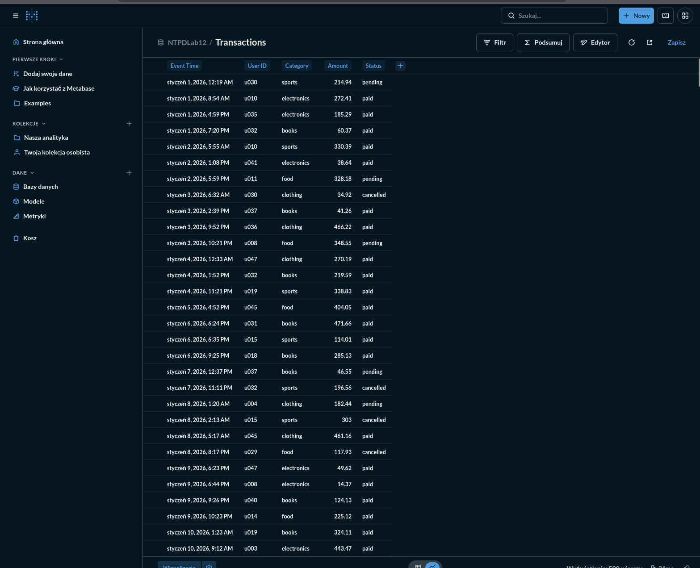
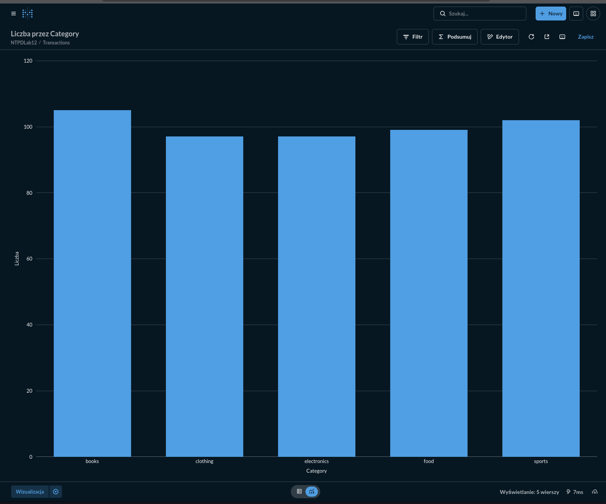
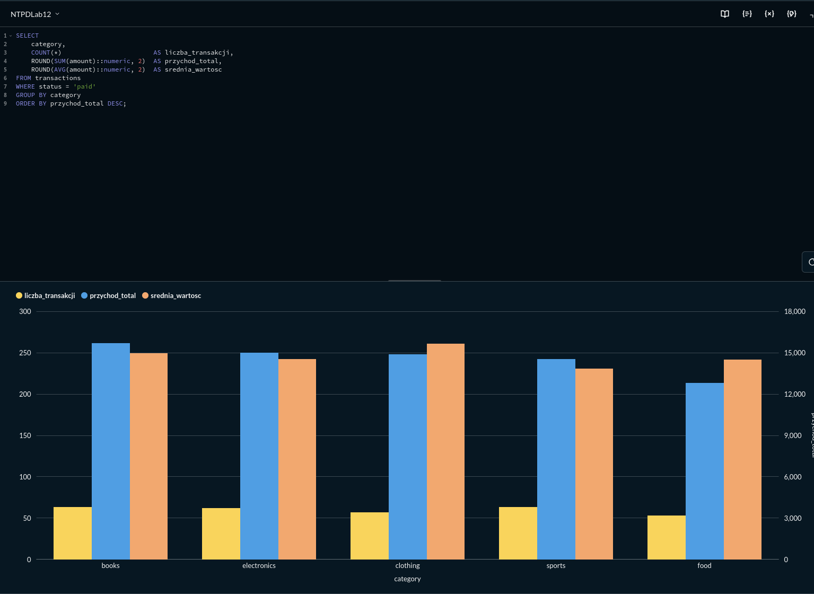
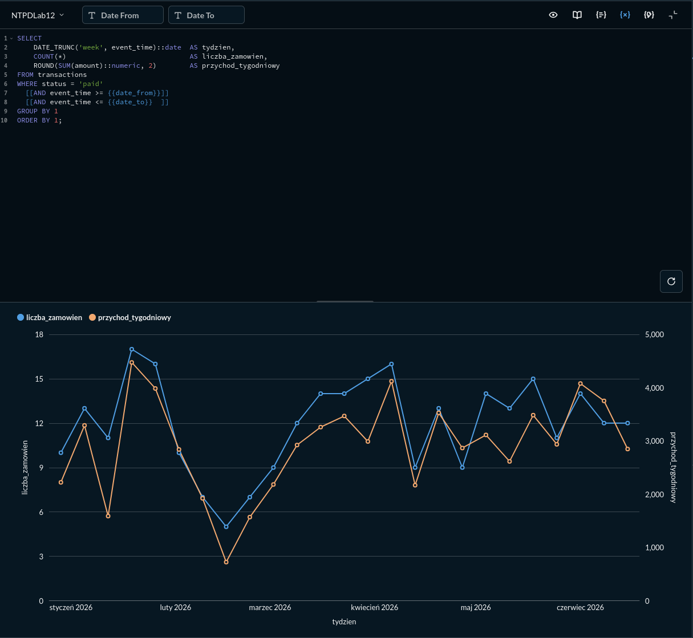
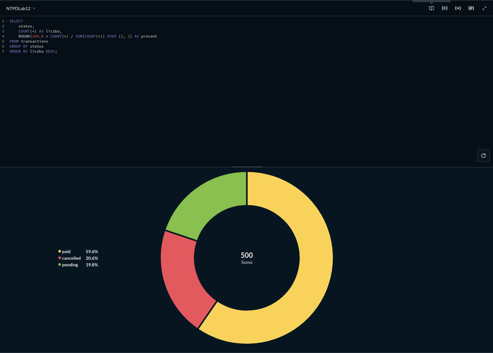
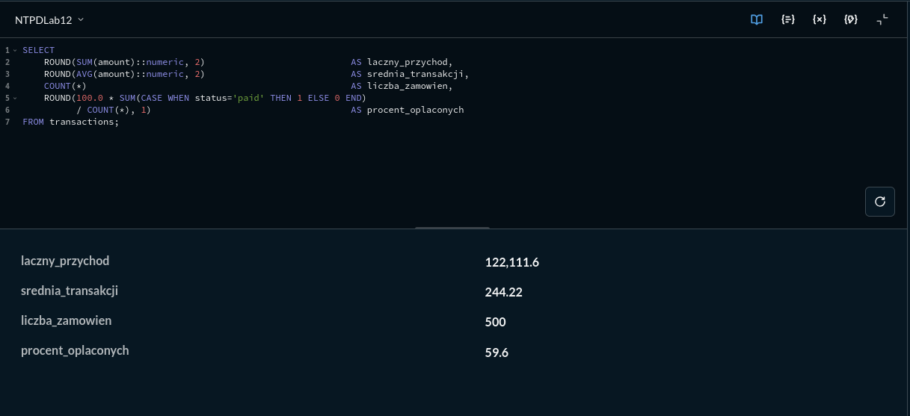
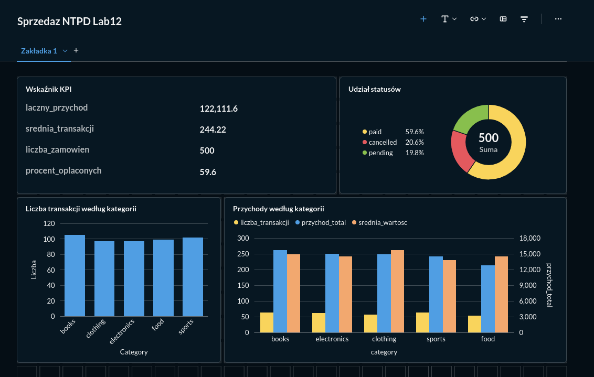

Uruchomienie projektu

Projekt został uruchomiony w następujący sposób:
-Docker: viinna@NieWiem:~/PycharmProjects/NTPDLab12$ docker compose up -d
-main.py: poprzez PyCharma
-Metabase: http://localhost:3000

Połączenie z bazą danych:

import psycopg2

conn = psycopg2.connect(
    host="localhost",
    port=5432,
    database="metabase",
    user="metabase",
    password="metabase"

Zadanie 2:

Zadanie 3:
Pierwsze zapytanie (zbudowane wizualnym kreatorem zapytań): Suma sprzedaży dla każdego produktu. Wybrałam wykres słupkowy ponieważ był on najlepszy do porównania kategorii

Drugie zapytanie: liczba transakcji, przychód i średnia wartość dla każdego z produktów. Wybrałam ponownie wykresy słupkowe, ponieważ w tej formie różnice miedzy różnymi zależnościami dla różnych produktów są najlepiej widoczne

Trzecie zapytanie: liczba zamówień, a przychód tygodniowy. Wybrałam wykres liniowy, ponieważ dobrze pokazuje zależności pomiędzy tymi dwoma cechami w czasie. 

Czwarte zapytanie: stan zapłaty. Wybrałam wykres kołowy, ponieważ najlepiej pokazuje jakie jest rozłożenie procentowe, pomiędzy transakcjami opłaconymi, anulowanymi i oczekujacymi.

Piąte zapytanie: łączny przychód, średnia transakcji, liczba zamówień, procent opłaconych. Wybrałam tabelę, ponieważ dla każdego elementu jest tylko jedna wartość. 

Zadanie 4 
Świeżo utworzony dashboard:

Utworzenie filtru

Filtrowanie:

Pierwsze testowanie filtru

Drugie testowanie filtru

Zadanie 5

Które kategorie generują największy przychód?
Na podstawie danych:
Największy przychód generują laptopy. Najmniejszy tablety.

Przetwarzanie danych vs Business Intelligence

| Obszar | Przetwarzanie danych | Business Intelligence |
|--------|-----------------------|-----------------------|
| Cel | przygotowanie danych (ETL, czyszczenie, łączenie) | analiza, raportowanie, wizualizacja |
| Narzędzia | Spark, Python, SQL, Airflow | Metabase, Power BI, Superset |
| Odbiorca | data engineer, analityk techniczny | biznes, managerowie |
| Wynik | dane gotowe do analizy | dashboardy, raporty, KPI |

Dashboard vs raport statyczny

| Dashboard | Raport statyczny |
|----------|------------------|
| interaktywny | nieinteraktywny |
| aktualizuje się automatycznie | stały w czasie |
| filtry, drill‑down | brak filtrów |
| do monitoringu | do jednorazowej analizy |

Zapytanie ad‑hoc vs zdefiniowany wskaźnik

| Zapytanie ad‑hoc | Zdefiniowany wskaźnik |
|------------------|-----------------------|
| jednorazowe | stały element raportowania |
| elastyczne | z góry ustalone |
| tworzone przez analityka | używane przez biznes |

Porównanie narzędzi BI:
Metabase vs Apache Superset

| Cecha | Metabase | Apache Superset |
|-------|----------|-----------------|
| Instalacja | prosta | bardziej złożona |
| Interfejs | intuicyjny | techniczny |
| Tworzenie pytań | GUI + SQL | głównie SQL |
| Dashboardy | proste | bardziej zaawansowane |
| Użytkownik | biznes, analitycy | data engineerzy |
| Uprawnienia | podstawowe | granularne |
| Integracje | podstawowe | szerokie |

Kiedy które będzie wygodniejsze: 
Metabase – gdy potrzebne są szybkie dashboardy i prosty interfejs.  
Superset – gdy wymagane są zaawansowane integracje i praca głównie w SQL.

